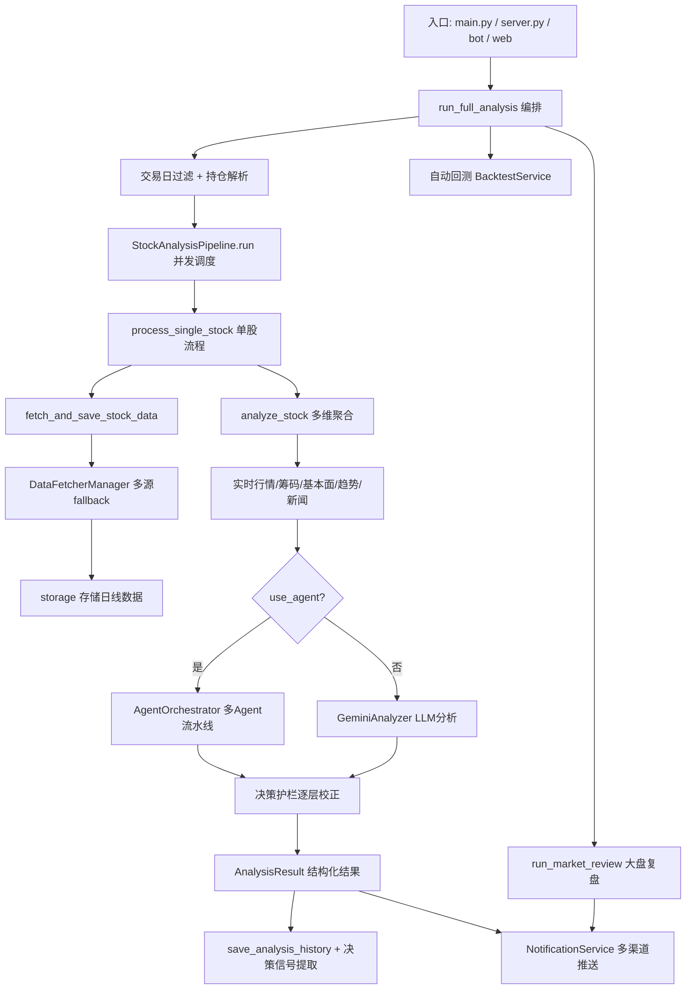

# 股票智能分析系统（daily_stock_analysis）架构与业务逻辑分析

> 本文档基于对仓库源码的实际走查整理，覆盖各模块职责、主流程编排、核心代码逻辑与模块协作关系。

## 1. 项目定位

基于 AI 大模型的 **A股 / 港股 / 美股 / 日股 / 韩股 / 台股** 自选股智能分析系统。核心主流程为：

```
抓取行情数据 → 技术分析 / 新闻情报检索 → LLM 智能分析 → 生成决策报告 → 多渠道通知推送
```

系统同时提供多种运行形态：

- **CLI / 定时任务**：`main.py` 命令行入口与 `schedule` 每日调度
- **FastAPI 服务**：`server.py` + `api/` 提供 REST API
- **Web 工作台**：`apps/dsa-web`（React + TypeScript + Vite）
- **桌面端**：`apps/dsa-desktop`（Electron 封装 Web）
- **机器人接入**：`bot/`（飞书 / 钉钉 / Telegram / Discord 等平台命令）

## 2. 顶层目录职责

| 目录 | 职责 |
|------|------|
| `main.py` | 分析任务主入口，CLI 参数解析、交易日过滤、流程编排 |
| `server.py` | FastAPI 服务入口 |
| `src/core/` | 主流程编排（pipeline、market_review、trading_calendar、backtest_engine） |
| `src/services/` | 业务服务层（60+ 服务：分析、告警、回测、选股、持仓、决策信号等） |
| `src/repositories/` | 数据访问层（ORM 之上的仓储封装） |
| `src/schemas/` | 数据结构 / 契约（决策动作、报告 Schema、市场结构） |
| `src/agent/` | 多 Agent 策略问股系统（orchestrator、executor、tools、skills、agents） |
| `src/llm/` | LLM 后端抽象（LiteLLM、本地 CLI 后端、Hermes、用量统计、缓存） |
| `src/notification_sender/` | 各通知渠道发送器 |
| `data_provider/` | 多数据源适配与 fallback（策略模式） |
| `api/` | FastAPI API 层（v1 endpoints、middlewares、deps） |
| `bot/` | 机器人命令与平台接入 |
| `scripts/` `.github/workflows/` `docker/` | 构建、CI、部署 |
| `strategies/` | 15 种内置策略 YAML 定义 |
| `templates/` | 报告 Jinja2 模板 |

## 3. 主流程编排（main.py）

### 3.1 CLI 参数体系

`parse_arguments()` 定义了完整的命令行契约，关键参数分组：

- **运行模式**：`--debug`、`--dry-run`（仅取数不分析）、`--schedule`（定时）、`--serve` / `--serve-only`（FastAPI）、`--webui`
- **股票选择**：`--stocks`（逗号分隔，覆盖配置）、`--portfolio futu`（券商真实持仓）
- **通知控制**：`--no-notify`、`--check-notify`、`--single-notify`（单股即时推送）
- **大盘复盘**：`--market-review`、`--no-market-review`、`--force-run`（跳过交易日检查）
- **回测**：`--backtest`、`--backtest-code`、`--backtest-days`、`--backtest-force`

### 3.2 环境引导（关键设计）

- 模块导入时立即执行 `setup_env()` 加载 `.env`，并按 `USE_PROXY` 配置代理（GitHub Actions 环境自动跳过）
- 采用 **懒加载 Descriptor**（`_LazyPipelineDescriptor`）解析 `StockAnalysisPipeline`，避免 API/Bot 消费者在导入时触发重量级依赖
- `_reload_env_file_values_preserving_overrides()` 支持定时任务热重载 `STOCK_LIST`（Issue #529），同时保留进程环境覆盖值

### 3.3 `run_full_analysis()` — 定时任务主函数

这是最核心的编排函数，执行顺序为：

1. **持仓解析**：`_resolve_portfolio_stock_codes()` 解析 Futu 真实持仓（作为独立契约边界，导入失败向上传播）
2. **股票索引刷新**：`_refresh_stock_index_cache_for_analysis()`（best-effort，失败不阻断）
3. **交易日过滤**：`_compute_trading_day_filter()` 按 **per-stock / per-market** 粒度过滤休市股票（Issue #373）；指数代码通过 `parse_analysis_target` 判型后按 `market=cn` 参与过滤
4. **空列表快速失败**：`STOCK_LIST` 为空且未启用大盘复盘时，记录 `empty_stock_list` 失败原因并返回 False
5. **大盘上下文预热**：`_prime_daily_market_context()` 复用/加载当日市场上下文（preload-only，避免后台无限生成）
6. **个股分析**：`pipeline.run()` 执行并发分析
7. **大盘复盘**：通过共享锁 `_run_market_review_with_shared_lock()` 防止并发复盘
8. **合并推送**：`merge_notification` 支持个股 + 大盘合并推送（Issue #190）
9. **自动回测**：`_run_auto_backtest()` 独立配置，失败不影响分析主流程

设计哲学体现在 `_LAST_ANALYSIS_FAILURE_REASON` 全局状态与 **单股失败不影响整体** 的异常隔离。

## 4. 核心分析流水线（src/core/pipeline.py）

`StockAnalysisPipeline` 是系统最核心的类（约 4400 行），负责整个分析生命周期。

### 4.1 `run()` — 批量并发调度

```
1. 解析股票列表（缺省时刷新配置）
2. 过滤 unsupported 目标 + 按 canonical_id 去重（发生在任何 provider 调用前）
3. 冻结本轮统一参考时间（避免跨市场收盘边界时目标交易日不一致）
4. 批量预取（股票数 >= 5 时）：
   - prefetch_daily_klines（30日K线）
   - prefetch_realtime_quotes（实时行情）
   - prefetch_stock_names（避免并发时显示"股票xxxxx"，Issue #455）
5. ThreadPoolExecutor 并发执行 process_single_stock
6. 收集结果 → 发送通知 / 保存报告
```

### 4.2 `process_single_stock()` — 单股完整流程

线程池调用单元，严格异常隔离（`try/except/finally` 保证单股失败返回 None 而不抛出）：

1. **冻结目标交易日**：`_resolve_resume_target_date()` + `set_frozen_target_date()`（断点续传语义）
2. **激活诊断上下文**：`activate_run_diagnostic_context()`（trace_id / query_id 链路追踪）
3. **Step 1 取数存数**：`fetch_and_save_stock_data()`（失败也尝试用已有数据继续）
4. **Step 2 AI 分析**：`analyze_stock()`
5. **单股推送**：`single_stock_notify` 模式下立即推送（#55）
6. **进度上报**：`_emit_progress()` 桥接到任务 SSE 进度

### 4.3 `analyze_stock()` — 分析核心（关键业务逻辑）

这是最丰富的业务编排，按步骤聚合多维数据后交给 LLM：

```
Step 0  市场阶段上下文 build_market_phase_context（盘前/盘中/午休/收盘竞价/非交易）
        每日市场上下文 _load_daily_market_context
Step 1  实时行情 get_realtime_quote（量比、换手率）— 自动故障切换，降级为历史收盘价
Step 2  筹码分布 get_chip_distribution — 带熔断保护（指数目标跳过）
Step 2.5 基本面能力聚合 get_fundamental_context（带 budget_seconds 超时预算）
         - 失败返回 partial/failed，不拖垮技术面/新闻链路
         - 指数目标跳过 fundamental/belong_boards/capital_flow/lhb/corporate_events
         板块归属 _attach_belong_boards_to_fundamental_context
         市场结构 _build_market_structure_context
         基本面快照写入（P0：write-only，fail-open）
Step 3  趋势分析 StockTrendAnalyzer（Agent 分支前执行，两条路径共用）
...     多维度情报搜索（最新消息 + 风险排查 + 业绩预期）
...     分支决策：use_agent（Agent 模式）vs 传统 GeminiAnalyzer 模式
```

**指数能力矩阵**（`INDEX_SKIP_MODULES`）是重要设计：对指数目标在任何 provider 调用之前就跳过筹码、基本面、板块、资金流、龙虎榜、公司事件模块，保证零底层调用。

### 4.4 Agent 分支 `_analyze_with_agent()`

当 `agent_mode` 开启或配置了特定 skills 时走 Agent 路径：

1. 通过 `build_agent_executor()` 工厂构建执行器（ToolRegistry / SkillManager 缓存复用）
2. 指数目标过滤不兼容工具 `_filter_agent_tools_for_index()`
3. 构建 `initial_context`（注入实时行情、筹码、趋势、社交舆情、本地情报池）
4. 激活新闻证据作用域 `activate_news_evidence_scope()`（精确统计 Agent 实际消费的检索证据）
5. `executor.run()` 执行多 Agent 流水线
6. `_agent_result_to_analysis_result()` 转换结果
7. **多层决策护栏**（关键）：
   - `stabilize_decision_with_structure()` — 结构/基本面稳定化
   - `apply_phase_decision_guardrails()` — 市场阶段护栏
   - `apply_daily_market_context_guardrail()` — 大盘上下文护栏
   - 每层通过 `capture_pipeline_action_adjustment()` 记录决策调整链
8. 保存历史 + 提取决策信号 `_extract_decision_signal_after_history_save()`

## 5. 数据源适配层（data_provider/）

### 5.1 策略模式设计

- `BaseFetcher`：抽象基类，定义统一接口
- `DataFetcherManager`：策略管理器，实现自动故障切换

**防封禁三策略**：① 每个 Fetcher 内置流控 ② 失败自动切换下一数据源 ③ 指数退避重试

### 5.2 数据源优先级（动态调整）

- **配置 TUSHARE_TOKEN 时**：Tushare(0) → Efinance(0) → Akshare(1) → Pytdx(2) → Baostock(3) → Yfinance(4) → Tencent(5)
- **未配置时**：Efinance(0) → Akshare(1) → Pytdx(2) → Tushare(2) → Baostock(3) → Yfinance(4) → Tencent(5) → Longbridge(5)

优先级数字越小越优先，同级按初始化顺序。此外还有 Finnhub、AlphaVantage、TickFlow、Futu、Tushare 等适配器与基本面适配器（`fundamental_adapter`、`yfinance_fundamental_adapter`、`futu_fundamental_adapter`）。

### 5.3 代码标准化 `normalize_stock_code()`

统一处理多市场代码格式（`base.py`），是跨市场路由的基础：

- A股：`SH600519`/`600519.SH` → `600519`；北交所 `BJ920748` → `920748`
- 港股：`hk1810`/`1810.HK` → `HK01810`（规范化为 5 位前缀形式）
- 日/韩/台：保留 Yahoo suffix（`7203.T`、`005930.KS`、`2330.TW`、`6505.TWO`）
- 美股：`AAPL` 原样保留

配套 `_is_hk_market` / `_is_jp_market` / `_is_kr_market` / `_is_tw_market` / `_is_us_market` 市场判定函数，用于路由到正确数据源。

## 6. 技术分析器（src/stock_analyzer.py）

`StockTrendAnalyzer` 实现了明确的**交易理念**（严进、趋势、效率、买点偏好）：

- **趋势状态**（`TrendStatus`）：强势多头 / 多头排列 / 弱势多头 / 盘整 / 弱势空头 / 空头排列 / 强势空头，基于 MA5>MA10>MA20 排列
- **量能状态**（`VolumeStatus`）：放量上涨/下跌、缩量上涨/回调（缩量回调为优选买点）
- **买入信号**（`BuySignal`）：强烈买入 → 买入 → 持有 → 观望 → 卖出 → 强烈卖出
- **技术指标**：MACD（12/26/9，金叉死叉、零轴上下）、RSI（6/12/24，超买超卖）
- **核心纪律**：乖离率 `(Close-MA5)/MA5 < 5%`（不追高）、缩量阈值 0.7、放量阈值 1.5、MA 支撑容忍度 2%

输出 `TrendAnalysisResult` 数据类，供 LLM 分析与决策护栏共用。

## 7. LLM 分析层（src/analyzer.py + src/llm/）

### 7.1 GeminiAnalyzer（analyzer.py，约 5100 行）

- 通过 **LiteLLM Router** 统一调用 Gemini / Anthropic / OpenAI / DeepSeek 等
- 结合技术面 + 消息面生成分析报告
- 解析 LLM 响应为结构化 `AnalysisResult`（用 `json_repair` 容错解析）
- **报告完整性校验**：`check_content_integrity()` + `apply_placeholder_fill()`（必填字段缺失时占位补全）
- **决策稳定化**：`stabilize_decision_with_structure()`、`populate_decision_action_fields()`、`fill_price_position_if_needed()`
- 多语言报告本地化（zh/en/ko，`src/report_language.py`）

### 7.2 LLM 后端抽象（src/llm/）

- `backend_registry.py`：后端 ID 注册（litellm / local_cli / codex / opencode）
- `generation_backend.py`：统一 `GenerationBackend` 接口（`GenerationResult` / `GenerationError`）
- `local_cli_backend.py`（104KB）：本地 CLI 后端（Codex/Claude CLI 集成）
- `hermes.py`：Hermes 渠道（密钥脱敏、路由屏蔽）
- `usage.py`：用量统计与消息 HMAC 稳定性审计
- `provider_cache.py`：Prompt 缓存提示与遥测

## 8. Agent 策略问股系统（src/agent/）

### 8.1 多 Agent 编排 `AgentOrchestrator`（orchestrator.py，约 2150 行）

管理专门化 Agent 生命周期，四种模式（成本/深度递增）：

- `quick`：Technical → Decision（最快，~2 次 LLM 调用）
- `standard`：Technical → Intel → Decision（默认）
- `full`：Technical → Intel → Risk → Decision
- `specialist`：额外加入策略专家评估

关键机制：

- 共享 `AgentContext` 顺序传递，收集各阶段 `StageResult`
- **超时预算**：cooperative budget（`_get_timeout_seconds`），超时后基于已完成阶段自动降级生成（`_build_timeout_result`）
- 每个 sub-agent 可配置独立超时钳制
- 与 `AgentExecutor` 暴露相同的 `run()` / `chat()` 接口，通过工厂 `AGENT_ARCH` 切换（drop-in replacement）

### 8.2 专门化 Agent（agents/）

`technical_agent`（技术面）、`intel_agent`（情报）、`risk_agent`（风险）、`decision_agent`（决策）、`portfolio_agent`（持仓），均继承 `base_agent`。

### 8.3 工具与技能

- **tools/**：`data_tools`（行情数据）、`analysis_tools`、`search_tools`（新闻检索）、`market_tools`、`backtest_tools`，由 `registry.py`（ToolRegistry）统一注册，`execution.py` 执行
- **skills/**：15 种内置策略（对应 `strategies/*.yaml`：均线金叉、缠论、波浪、多头趋势、热点题材、事件驱动、成长质量、预期重估等），由 `StrategyEngine` + `AgentSkillScheduler` 调度，支持并发批处理与证据分区
- **factory.py**：模块级缓存 ToolRegistry（不可变共享）与 SkillManager 原型（deepcopy 克隆保证线程安全）

### 8.4 其他核心组件

`llm_adapter.py`（LLMToolAdapter，40KB）、`memory.py`（会话记忆）、`chat_context.py`（可见历史压缩）、`disagreement.py`（Agent 分歧汇总）、`risk_override.py`（风险覆盖）、`runtime_facts.py`（运行时事实/降级边界）、`codex_app_server_transport.py`（Codex App Server 传输，44KB）。

## 9. 存储层（src/storage.py + src/repositories/）

### 9.1 storage.py（约 4370 行）

- **单例模式** 管理 SQLite 连接（`DatabaseManager.get_instance()`）
- SQLAlchemy ORM 定义数据模型：
  - `StockDaily`：日线行情 + 技术指标（`code`+`date` 唯一约束，含 `canonical_id` 稳定键用于 Expand-Contract 迁移）
  - `NewsIntel`：新闻情报（多维度 latest_news/risk_check/earnings/market_analysis/industry）
  - `AnalysisHistory`：分析历史（决策信号、上下文快照、诊断）
  - `DatabaseSchemaMigration`：Schema 版本标记
- **断点续传**：智能更新逻辑，避免重复抓取
- **SQLite 优化**：WAL 模式、busy_timeout、写重试（`SQLITE_WRITE_RETRY_*`）
- UTC-naive 时间统一处理（`utc_naive_now` / `to_utc_naive_datetime`）

### 9.2 repositories/

在 ORM 之上的仓储封装：`analysis_repo`、`backtest_repo`、`decision_signal_repo`、`portfolio_repo`（42KB）、`alert_repo`、`intelligence_repo`、`stock_repo`、`skill_opinion_*_repo`。

## 10. 通知层（src/notification.py + notification_sender/）

### 10.1 NotificationService（notification.py，约 3100 行）

- 汇总分析结果生成日报（Markdown）
- **多渠道自动识别推送**（`NotificationChannel` 枚举）：企业微信、钉钉、飞书、Telegram、Email、Pushover、ntfy、Gotify、PushPlus、Server酱3、Discord、Slack、AstrBot、自定义 Webhook
- **通知路由**（`notification_routing.py`）：分组路由到不同渠道
- **通知降噪**（`notification_noise.py`）：静默时段、严重级别过滤
- 策略综合块渲染、多语言标签本地化
- **稳定性护栏**：单一渠道失败不拖垮主流程

### 10.2 notification_sender/

每个渠道独立发送器（`feishu_sender.py` 25KB、`telegram_sender.py` 15KB 等），支持 Markdown 转图片（`src/md2img.py`、`src/share_image.py`）、飞书文档（`src/feishu_doc.py`）。

## 11. 搜索服务（src/search_service.py，约 4950 行）

- 统一新闻搜索接口，支持 Anspire、SerpAPI、Tavily、Bocha、Brave、MiniMax、SearXNG 多引擎
- **多 Key 负载均衡**（`itertools.cycle`）与故障转移
- **进程级硬超时**：题材新闻搜索在独立子进程执行（`spawn`），超时终止（`_call_topic_news_in_subprocess`），并发信号量限流（4 slots）
- **重试机制**：`tenacity` 对瞬态网络错误（SSL/Connection/Timeout）指数退避重试 3 次
- 搜索结果缓存与格式化，`newspaper` 库文章正文提取

## 12. 大盘复盘（src/core/market_review.py）

- `run_market_review()` 按 `MARKET_REVIEW_REGION` 选择市场（cn/hk/us/jp/kr/both，支持多区域有序）
- `MarketAnalyzer` 生成指数涨跌、市场概况（上涨/下跌/涨停/跌停）、板块表现（领涨/领跌）
- 多语言标题（zh/en/ko）
- **共享锁**（`market_review_lock.py`）防止并发复盘
- `MarketReviewRunResult` 结构化结果供 API/Web 消费，同时保留 Markdown 兼容
- 运行时上下文（`market_review_runtime.py`）与每日市场上下文服务（`daily_market_context.py`）

## 13. 定时调度（src/scheduler.py）

- `Scheduler` 基于 `schedule` 库实现每日定时（默认工作日 18:00 北京时间）
- 支持多时间点 `SCHEDULE_TIMES`、启动立即执行、运行时热重载调度时间
- `GracefulShutdown` 捕获 SIGTERM/SIGINT，确保任务完成后优雅退出
- `normalize_schedule_times()` 校验 HH:MM 格式并去重排序

## 14. API 层（api/）

### 14.1 FastAPI 结构

- `api/app.py`：应用工厂，挂载 `/api/v1` 前缀
- `api/deps.py`：依赖注入
- `api/middlewares/`：中间件（认证、CORS 等）
- `api/v1/router.py`：聚合 15 个 endpoint 路由

### 14.2 Endpoints

| 路由 | 职责 |
|------|------|
| `auth` | 登录、Cookie、会话（`ADMIN_AUTH_ENABLED`） |
| `analysis`（65KB） | 手动分析、任务进度 |
| `agent`（24KB） | Agent 策略问股、多轮对话 |
| `history`（36KB） | 历史报告查询 |
| `stocks`（22KB） | 股票搜索补全、代码/名称/拼音解析 |
| `portfolio`（25KB） | 持仓管理 |
| `system_config`（27KB） | 配置管理 |
| `decision_signals` | 决策信号 |
| `screening` | 选股引擎 |
| `backtest` | 回测 |
| `alerts` | 告警 |
| `intelligence` | 情报 |
| `usage` | LLM 用量统计 |
| `data` / `health` | 数据 / 健康检查 |

## 15. 机器人接入（bot/）

- `dispatcher.py`：`CommandDispatcher` 命令分发器 + `RateLimiter`（滑动窗口频率限制，默认 10 次/60 秒）
- `handler.py`：消息处理
- `models.py`：`BotMessage` / `BotResponse` 统一消息模型
- `commands/`：`analyze`（分析）、`ask`（问股 27KB）、`chat`（对话）、`market`（大盘）、`history`、`research`、`batch`、`status`、`strategies`、`help`
- `platforms/`：飞书、钉钉、Telegram、Discord 等平台适配

## 16. 业务服务层（src/services/，60+ 服务）

关键服务分组：

**分析与上下文**

- `analysis_service` / `analyzer_service` / `analysis_context_builder`：分析编排与上下文构建
- `analysis_timeout_partial`：超时部分通知（`DSA_TIMEOUT_PARTIAL_NOTIFY`）
- `daily_market_context`（36KB）：每日市场上下文
- `market_structure_service` / `market_hotspot_service` / `market_light_service`：市场结构、热点、灯号

**决策信号**

- `decision_signal_service`（55KB）/ `decision_signal_extractor` / `decision_signal_outcome_service` / `decision_signal_reassess_service`：决策信号提取、结果追踪、重估

**告警**

- `alert_service`（54KB）/ `alert_worker`（38KB）/ `alert_indicators` / `portfolio_alerts` / `market_light_alerts`

**回测与选股**

- `backtest_service`（48KB）：历史分析结果评估（eval window、min age）
- `screening_service`（156KB）+ `screening/`：选股引擎（最大服务文件）

**持仓与组合**

- `portfolio_service`（68KB）/ `portfolio_import_service` / `portfolio_risk_service`

**运行与任务**

- `run_flow`（55KB）：运行流程编排
- `run_diagnostics`（56KB）：运行诊断（trace/provider/llm/notification/history 事件记录）
- `task_queue`（41KB）/ `task_service` / `runtime_scheduler`（32KB）：后台任务队列与运行时调度

**数据能力与配置**

- `data_capability_service`（46KB）：数据源能力矩阵
- `system_config_service`（238KB）：系统配置服务（最大文件）
- `generation_backend_status_service` / `agent_backend_status_service`：后端状态

**导入与解析**

- `stock_list_parser`（56KB）：股票列表解析（`AnalysisTarget` / `ParseStatus`）
- `name_to_code_resolver`（34KB）：名称/拼音/别名 → 代码
- `image_stock_extractor`：图片识别提取股票（含 `EXTRACT_PROMPT`）
- `import_parser`：CSV/Excel 导入

**情报与舆情**

- `intelligence_service`（36KB）/ `social_sentiment_service`（美股 Reddit/X/Polymarket）/ `empty_news`

## 17. 前端（apps/）

### 17.1 dsa-web（React + TypeScript + Vite）

`src/` 结构：

- `pages/`（12 页面）：工作台、分析、历史、持仓、回测、选股、配置、Agent 问股（/chat）等
- `components/`、`hooks/`（12）、`stores/`（状态管理）、`contexts/`
- `api/`（16 模块）：对接后端 REST API
- `i18n/` + `locales/`：多语言
- `desktop/`：桌面端专属逻辑
- 测试：Vitest（单测）+ Playwright（e2e）

### 17.2 dsa-desktop（Electron）

封装 Web 构建产物为桌面应用，含自动更新（`verify-desktop-updater-artifacts`）。

## 18. 核心设计模式与工程实践

1. **策略模式 + 自动 fallback**：数据源、LLM 后端、搜索引擎均采用统一接口 + 优先级切换 + 熔断降级
2. **单例模式**：Config、DatabaseManager、ToolRegistry 缓存
3. **懒加载**：重量级依赖通过 Descriptor / 函数内 import 延迟加载
4. **异常隔离**：单股失败、单渠道失败、单数据源失败均不拖垮主流程（fail-open）
5. **诊断链路**：`run_diagnostics` 贯穿 provider/llm/notification/history，trace_id + query_id 全链路追踪
6. **多层决策护栏**：LLM 输出经结构稳定化 → 市场阶段护栏 → 大盘上下文护栏逐层校正
7. **能力矩阵**：指数目标通过 `INDEX_SKIP_MODULES` 在 provider 调用前跳过不适用模块
8. **契约优先**：`AnalysisTarget` / `ParseStatus` / `AnalysisResult` / Schema 层保证跨模块数据一致性
9. **多语言**：报告 zh/en/ko 本地化贯穿分析、通知、复盘
10. **稳定性优先**：超时预算、重试、限流、进程级隔离、优雅退出

## 19. 端到端数据流总览



---

**文档说明**：本分析基于源码实际走查整理，重点覆盖主流程编排（main.py / pipeline.py）、数据源策略层、LLM/Agent 双分析路径、存储与通知层。由于项目规模庞大（`system_config_service.py` 238KB、`pipeline.py` 199KB、`screening_service.py` 156KB 等），部分服务的内部实现细节仅做了职责级归纳，如需深入某一模块可进一步展开。
